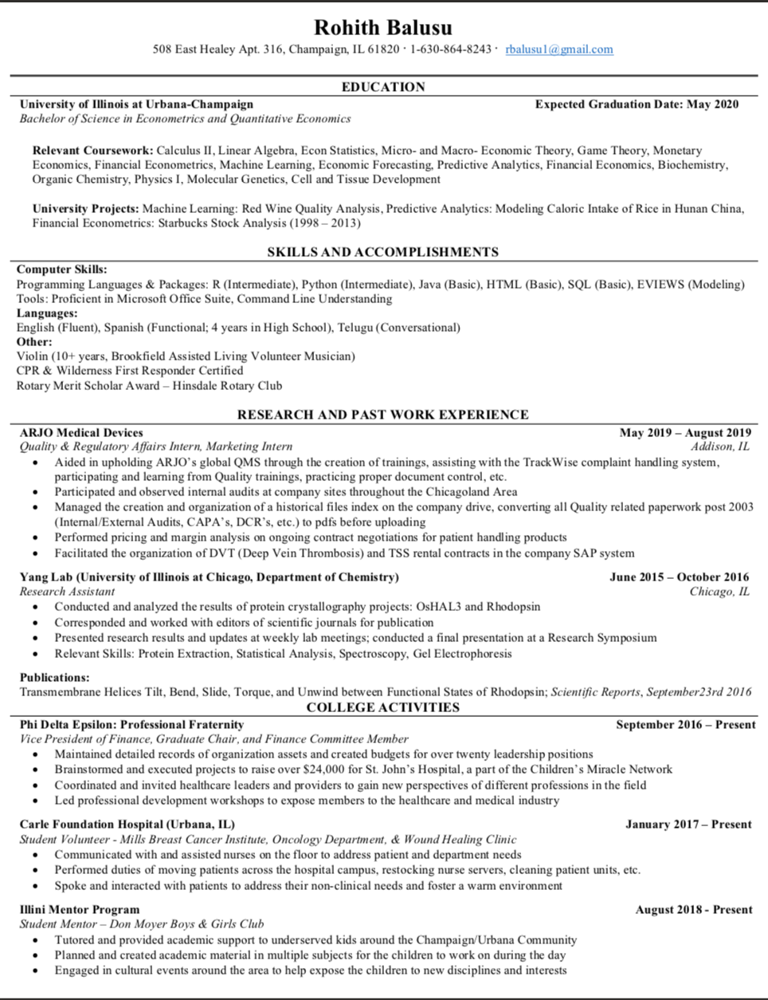

## Welcome to Rohith Balusu's Website!


### A Little Bit About Myself

I am currently a senior majoring in Econometrics and Quantative Economics at the University of Illinois at Urbana Champaign. In my free time I enjoy spending time with my friends playing board games, watching movies, and going out to eat. Some of my passions and hobbies include learning to cook new dishes and volunteering in the local community. Some of my future aspirations include pursuing a career in business, particularly with something related to the healthcare industry. 

```markdown
Syntax highlighted code block

# Header 1
## Header 2
### Header 3

- Bulleted
- List

1. Numbered
2. List

**Bold** and _Italic_ and `Code` text

[Link](https://www.linkedin.com/in/rohith-balusu-4991a1173/) 



```

For more details see [GitHub Flavored Markdown](https://guides.github.com/features/mastering-markdown/).

### Jekyll Themes

Your Pages site will use the layout and styles from the Jekyll theme you have selected in your [repository settings](https://github.com/brohith123/brohith123.github.io/settings). The name of this theme is saved in the Jekyll `_config.yml` configuration file.

### Support or Contact

Having trouble with Pages? Check out our [documentation](https://help.github.com/categories/github-pages-basics/) or [contact support](https://github.com/contact) and we’ll help you sort it out.
